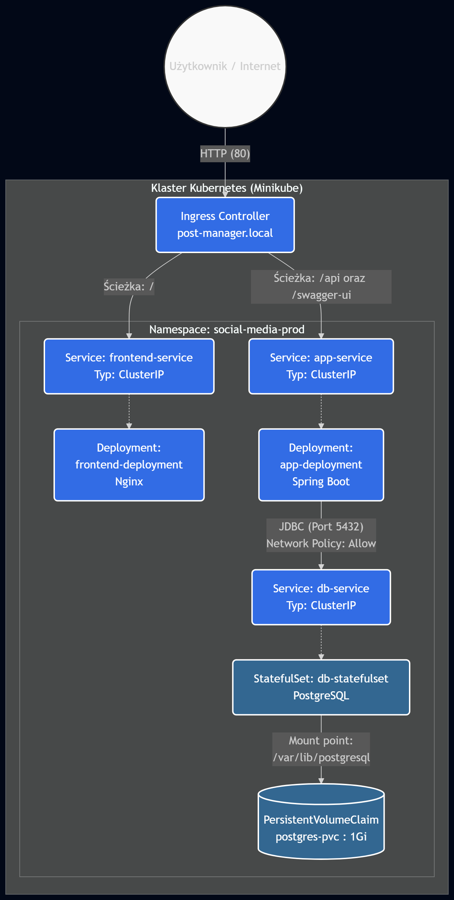
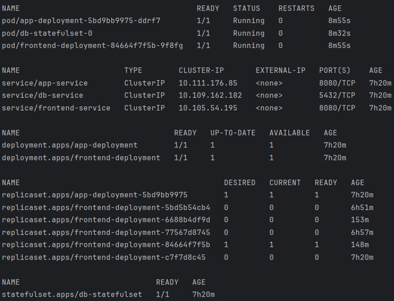

# Social Media Post Manager - System Mikrousługowy
Projekt budowy skonteneryzowanej aplikacji do zarządzania postami, realizowany w architekturze mikroserwisowej z naciskiem na zaawansowane mechanizmy bezpieczeństwa w ekosystemie Kubernetes (DevSecOps).

## Architektura Systemu
System składa się z trzech odseparowanych warstw, zarządzanych przez kontroler Ingress:
1. **Frontend (Nginx)**: Interfejs użytkownika, uruchomiony w trybie non-root.
2. **Backend (Java Spring Boot)**: Logika biznesowa, REST API oraz Swagger UI.
3. **Database (PostgreSQL)**: Izolowany magazyn danych, wdrożony jako StatefulSet.



## Bezpieczeństwo i Konfiguracja
### Kluczowe cechy wdrożenia:
* **Izolacja Sieciowa (Zero Trust):** Wdrożono `NetworkPolicy`, która blokuje całkowicie ruch sieciowy do bazy PostgreSQL, zezwalając na dostęp wyłącznie z podów backendowych na porcie 5432.
* **Zarządzanie Przestrzenią (Namespace):** Cały system rezyduje w wyizolowanej przestrzeni nazw `social-media-prod`.
* **Resource Quotas**: Na poziomie klastra zdefiniowano limity zasobów (maks. 2 CPU i 2 GB RAM), chroniące infrastrukturę przed atakami typu DoS oraz wyciekami pamięci.
* **Trwałość Danych:** Baza danych korzysta z zewnętrznego wolumenu dyskowego (`PersistentVolumeClaim` o rozmiarze 1 GB), gwarantując przetrwanie danych niezależnie od cyklu życia podów.
* **Zarządzanie Konfiguracją:** Użyto obiektów `ConfigMap` oraz `Secret` (Base64) do wstrzykiwania konfiguracji, oddzielając środowisko od kodu źródłowego. Wrażliwe dane, takie jak hasła do bazy, są przechowywane w zaszyfrowanych obiektach.
* **Strategia Aktualizacji**: Wykorzystano RollingUpdate z parametrem `maxUnavailable: 25%`, co gwarantuje wysoką dostępność usług podczas wdrażania zmian.

## Analiza Zagrożeń (Docker Scout)
Przeprowadzono audyt obrazu `app-service` pod kątem podatności.
Wyniki skanowania:
* **Wykryte podatności**: 32 (1 Critical, 7 High, 12 Medium, 7 Low).
* **Kluczowe ryzyko**: CVE-2026-32767 (Critical) w bibliotece `expat` oraz błędy w serwerze Tomcat.
* **Rekomendacja**: Aktualizacja obrazu bazowego do wersji `26-jre-alpine` w celu usunięcia luki krytycznej.


## Uruchomienie projektu
Krok 0: Pobierz repozytorium:
```bash
git clone https://github.com/SzymonKozyra/social-media-post-manager.git
cd social-media-post-manager
```
### Opcja A: Docker Compose
1. Zbuduj i uruchom aplikację: 
```bash
mvn clean package -DskipTests
docker compose up --build -d
```
2. Aplikacja będzie dostępna pod adresem: 
- http://localhost:80

### Opcja B: Kubernetes 
1. Uruchom klaster i włącz kontroler Ingress: 
```bash
minikube start --cni=calico
minikube addons enable ingress
```
2. Zaaplikuj infrastrukturę: 
```bash
kubectl apply -f ./k8s
```
3. Sprawdź status wdrożenia:
```bash
kubectl get all -n social-media-prod
```
**Wskazówka:** Jeśli lista zasobów jest pusta, mimo poprawnego wykonania `apply`, Twój kubectl może operować w innej przestrzeni nazw. Ustaw domyślny kontekst komendą:
```bash
kubectl config set-context --current --namespace=default
```
**Oczekiwany rezultat:** szystkie pody powinny mieć status **Running**, baza danych powinna być uruchomiona jako **StatefulSet**, a wszystkie serwisy wewnętrzne (App, DB, Frontend) powinny mieć typ **ClusterIP**.


4. Skonfiguruj dostęp z zewnątrz
* Zmodyfikuj plik systemu (na Windows: C:\Windows\System32\drivers\etc\hosts, na Linux/Mac: /etc/hosts), dopisując linię:
```
127.0.0.1 post-manager.local
```
* W nowym oknie terminala uruchom tunel sieciowy (nie zamykaj tego okna):
```
minikube tunnel
```
5. Uzyskaj dostęp do aplikacji:
* Frontend (Aplikacja): http://post-manager.local
* Dokumentacja API (Swagger): http://post-manager.local/swagger-ui/index.html